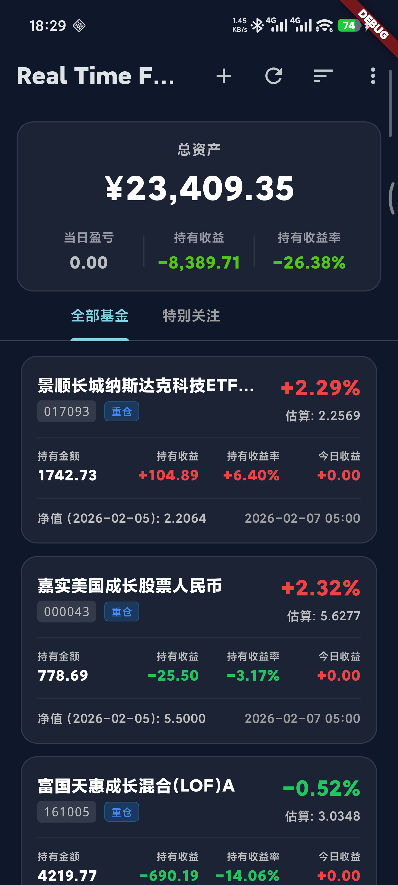

# real-time-fund (Flutter版)

基于 Flutter 构建的跨平台实时基金追踪应用。它可以帮助你实时追踪基金持仓，计算收益，并通过 Supabase 在多设备间同步数据。

本项目是原 [real-time-fund](https://github.com/inannan/real-time-fund) 插件/应用的 Flutter 重写版本，带来了原生性能和多平台支持（iOS, Android, macOS, Web）。

## ✨ 功能特性

- **实时数据**: 从天天基金和腾讯财经获取实时估值和净值数据。
- **持仓管理**: 记录持仓成本、份额，自动计算当日收益和总收益。
- **云端同步**: 使用 Supabase 在不同设备间同步你的基金、持仓和分组数据。
- **分组管理**: 自定义分组管理基金，追踪更清晰。
- **隐私模式**: 一键隐藏敏感金额信息。
- **详细透视**: 查看基金详情，包括前十大重仓股及其当日表现。
- **跨平台**: 在 iOS, Android, macOS 和 Web 上流畅运行。

## 🛠️ 技术栈

- **框架**: [Flutter](https://flutter.dev/)
- **状态管理**: [Provider](https://pub.dev/packages/provider)
- **后端 / 同步**: [Supabase](https://supabase.com/)
- **网络**: `http`, `fast_gbk` (处理旧编码)
- **存储**: `shared_preferences` (本地), Supabase (云端)
- **UI**: Material Design 3 配合自定义深色模式优化

## 🚀 快速开始

### 前置要求

- 已安装 [Flutter SDK](https://docs.flutter.dev/get-started/install)。
- 一个 [Supabase](https://supabase.com/) 项目（免费版即可）。

### 安装步骤

1. **克隆仓库**
   ```bash
   git clone git@github.com:Crazy-MT/real-time-fund.git
   cd real-time-fund
   ```

2. **安装依赖**
   ```bash
   flutter pub get
   ```

3. **配置**
   
   本项目使用 Supabase 进行身份验证和数据同步。你需要提供自己的 Supabase 凭据。

   打开 `lib/config.dart` 并更新以下字段：

   ```dart
   class Config {
     static const String supabaseUrl = '你的_SUPABASE_URL';
     static const String supabaseAnonKey = '你的_SUPABASE_ANON_KEY';
   }
   ```
   
   *注意：请确保在你的 Supabase 项目设置中启用了 邮箱/密码 认证。*

4. **运行应用**

   ```bash
   # 在 macOS 上运行
   flutter run -d macos

   # 在 Chrome 上运行
   flutter run -d chrome
   ```

## 📱 截图



## 📄 许可证

本项目基于 MIT 许可证开源 - 查看 [LICENSE](LICENSE) 文件了解详情。

## 🙏 致谢

- 原项目: [real-time-fund](https://github.com/inannan/real-time-fund)
- 数据来源: 天天基金, 腾讯财经

## ☕ 支持作者

如果你觉得这个项目对你有帮助，欢迎请我喝杯咖啡！

| 微信支付 | 支付宝 |
|------------|--------|
|  |  |
